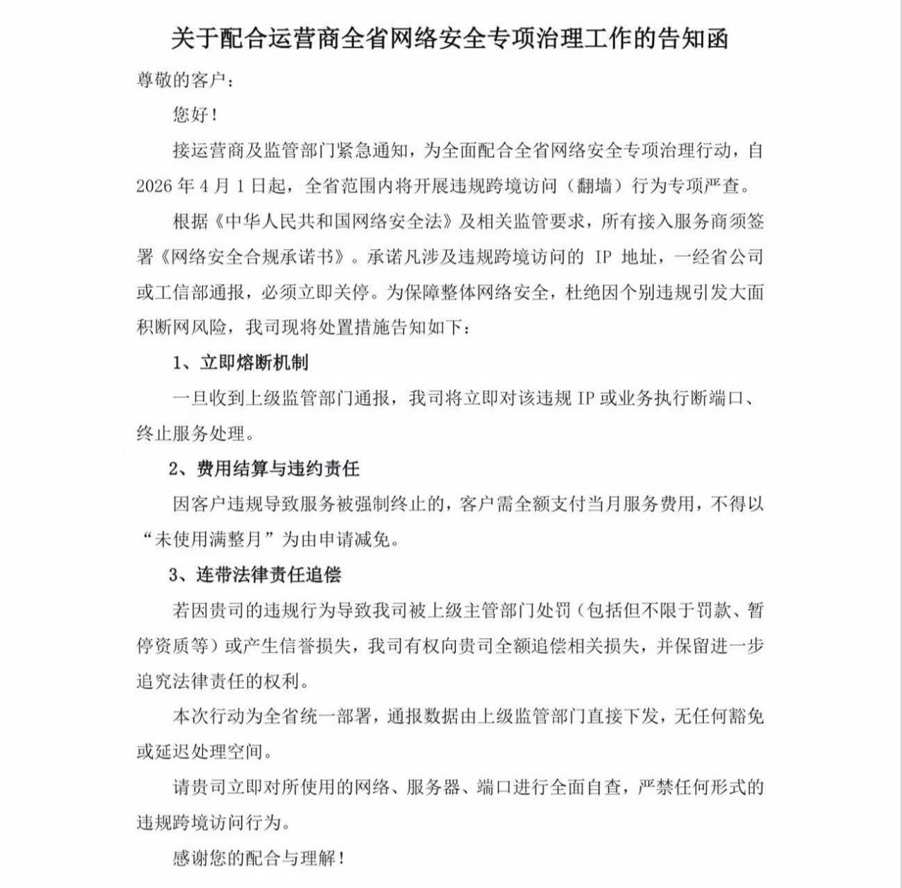

# 2026 广东网络治理风暴：全省整治违规跨境访问，IDC 行业迎来“拔线潮”

## 前言

2026年4月初，广东 IDC（互联网数据中心）圈子内掀起了一场前所未有的“网络安全专项治理”风暴。从广州、深圳到东莞，多家机房接连传出“拔线”、“清退”的消息。

这场风暴的起因，是一份来自运营商及监管部门的紧急通知。本文将结合近期流传的几份核心告知函与现场通报，带大家深入了解这次治理行动的严峻程度。

---

## 核心解读：运营商的“最后通牒”

在这场治理行动中，最引人注目的是一份名为**《关于配合运营商全省网络安全专项治理工作的告知函》**的文件。

这份文件明确指出：
- **生效时间**：自2026年4月1日起。
- **治理重点**：全省范围内严查违规跨境访问（即俗称的“翻墙”）行为。
- **熔断机制**：一旦收到通报，立即关停违规IP或业务端口。
- **违约责任**：因违规导致的关停，不仅不退还当月费用，还将追究连带法律责任。

这种“零容忍”的态度，预示着过去那种“猫鼠游戏”的空间已被极度压缩。

---

## 现场实况：广东多地机房陷入“紧急状态”

随着治理行动的深入，从各大运维群传回的消息显示，治理力度远超预期。

### 1. 广州与深圳：大厂亦难幸免

根据流出的通报显示，广州机房已开始执行“通报即关机”的政策，甚至连 top3 级别的大型云厂商资源也被紧急拔线。这种“不分规模、只看违规”的做法，让许多依靠海外节点进行业务交付的中小企业措手不及。

### 2. 东莞与周边：系统性清退

东莞移动等运营商也发布了全系下架清退的通知，受“不可抗力”影响，大量资源处于“择日恢复”的无限期等待中。

---

## 治理逻辑：从“点对点”到“整块拔线”

此次行动的一个显著特点是：**连坐机制**。

以往的治理往往针对具体的违规 IP，而此次通报中提到：“后续所有客户出现通报一律拔线整个区域，无退款！”

这意味着，即便你的业务是合规的，如果你的服务器所在的整个区域或子网中存在大量违规行为，你也有可能面临“池鱼之殃”。这种高压策略旨在逼迫所有接入商和用户进行严格的自查。

---

## 应对策略：用户该如何自处？

面对这场突如其来的治理风暴，建议相关从业者和企业用户采取以下措施：

1. **立即自查**：核对所使用的网络、服务器、端口，确保无任何形式的违规跨境访问行为。
2. **业务合规化**：如果业务确实需要跨境访问，务必通过合法的跨境专线或运营商正规渠道申请。
3. **备份与冗余**：针对目前的“拔线潮”，务必做好跨地域的数据备份，避免因单一机房被整体拔线导致业务彻底中断。
4. **理性退款**：对于已付费但被清退的用户，应关注运营商提供的退款通道，理性沟通。

## 结语

2026年的网络环境，合规已不再是“可选项”，而是“生死线”。广东作为互联网高地，此次专项治理无疑是一个强烈的信号。在网络安全与合规的大背景下，唯有守法经营，才能在风暴中生存。

---
> *免责声明：本文内容基于网络公开流传的图片及通报整理，旨在传递行业动态，不构成任何投资或法律建议。*
